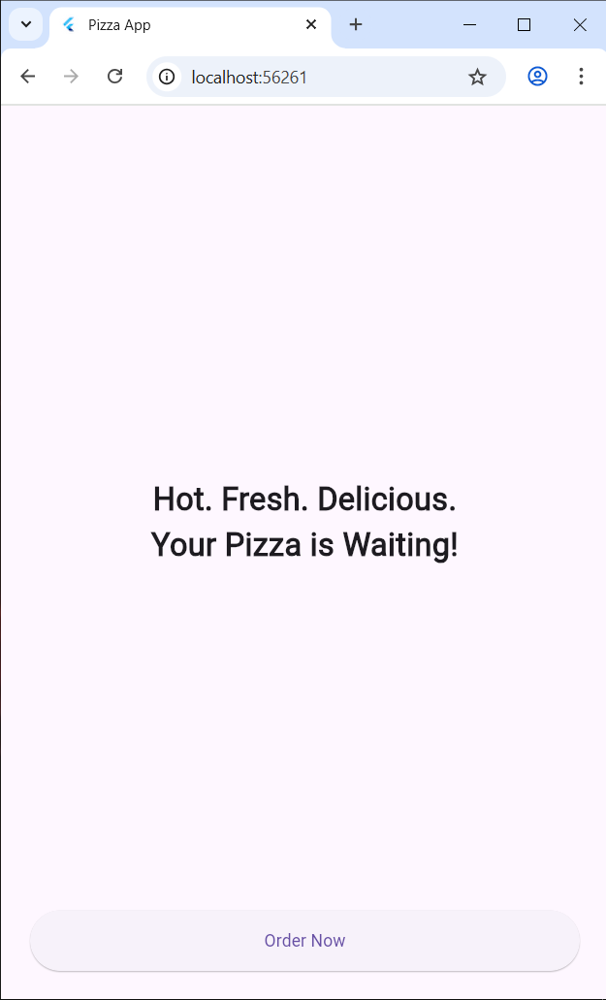
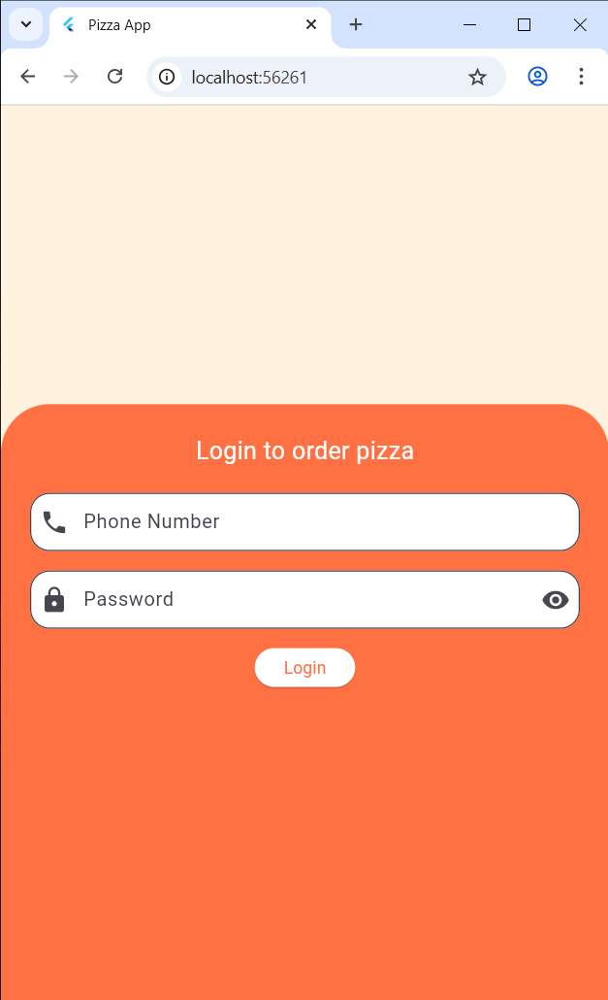
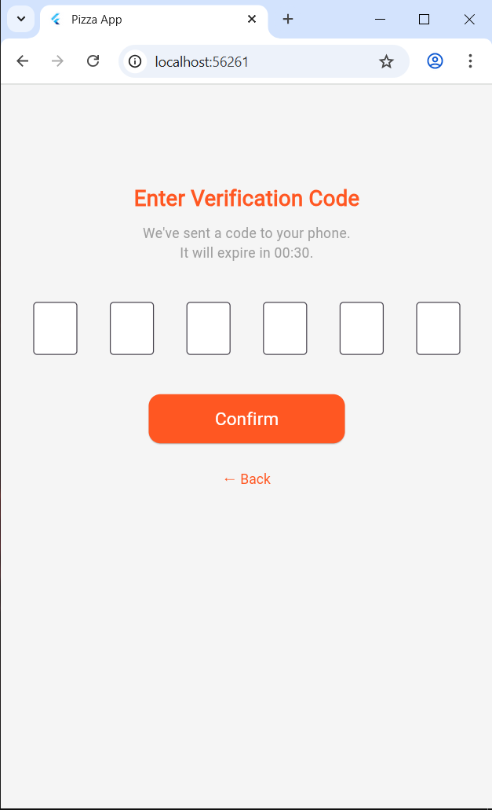
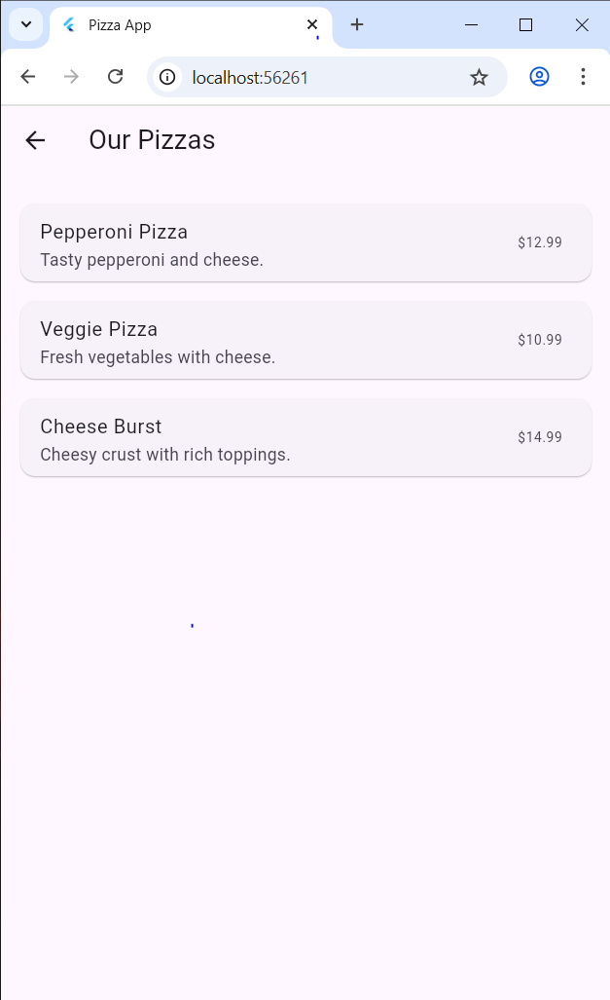

# Simple App - Flutter

This is a beginner-friendly Flutter app that simulates a pizza ordering experience with clean navigation and basic UI components.

## 📱 Screens Included

1. **Welcome Screen**  
   - A simple welcome message with a call-to-action "Order Now" button.

2. **Login Screen**  
   - Takes a phone number and password.
   - Simulates login and proceeds to OTP screen.

3. **OTP Screen**  
   - User enters a 6-digit OTP.
   - Once validated, user is taken to product list.

4. **Product List Screen**  
   - Shows a list of 3 pizza products.
   - Each item has a name, price, and description.

---

## 🔧 How to Run

1. Make sure you have Flutter installed.  
   [Flutter Installation Guide](https://docs.flutter.dev/get-started/install)

2. Clone the repo:

   ```bash
   git clone https://github.com/your-username/pizza-app.git
   cd pizza-app

## 📸 Screenshots

<p align="center">
  
  
</p>
<p align="center">
  
  
</p>
